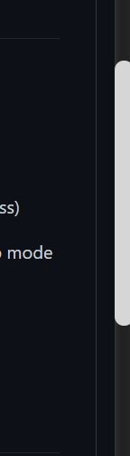
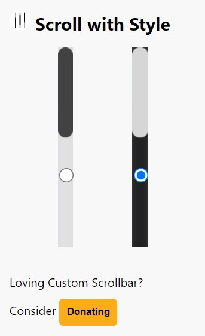

# Stylized Scrollbar

## About

This project is a Chrome extension by: Andrew Li
It is a simple extension that modifies the scrollbar to look better.

Now available of the [Chrome store](https://chrome.google.com/webstore/detail/stylized-scrollbar/igpchmaapelclmhofnheepclmfniobnc?hl=en)

Options Menu:

## How to Install

To install this extension

1. Clone this GitHub repo or download zip

2. Unzip download (don't need to unzip if cloned)

3. Go to Chrome extension page by going to chrome://extensions/ (as a URL address)

4. Click Load unpacked and navigate to the unzipped folder (might require develop mode to be enabled)

5. Confirm

Now you have the extension installed!! 🤩
## Licence

The rules for copy and distributing this project licence are 
outlined in the licence.txt file.

This project is under an MIT licence 

## Contributions/Bugs

If you notice any bugs, please report it by opening an issue.

If you want to contribute code, you are welcome to do so however, 
I am a busy student so don't be offended if I don't respond in a timely manner

# Support Me

[GitHub Sponsorships](https://github.com/sponsors/Zeyu-Li)

